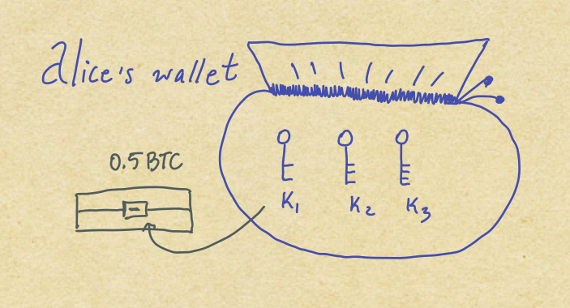

# Bitcoin

About nine years ago, somebody calling themselves
**Satoshi** sent [an email](http://www.metzdowd.com/pipermail/cryptography/2009-January/014994.html)
introducing the first version of the Bitcoin software.
When this software is active, the computer running it
becomes a **Bitcoin node**. Such nodes link up with
each other to form the **Bitcoin network**. The Bitcoin
network has its own native currency called the
lower-case **bitcoin**. There's only ever going to be
21 million bitcoin, which have started to acquire value,
because people find the properties that the currency has
useful. Bitcoin represents a new kind of system, and might
come to have rather wide-ranging impact on the world.

Although Bitcoin exists to solve problems for people, and
it is the beliefs of people that gives bitcoin value, it
is still fundamentally a system of software. This article
will for this reason try to explain what the Bitcoin
software actually **is**, which will help understand why
many of us find it so interesting, and make it easier to
make good decisions about how to interact with or attempt
to modify Bitcoin. I will try to avoid making the
explanation more complex than necessary, but I will need
to introduce some concepts like public key cryptography
and hashing.

## Bitcoin software

* todo: mention lineage of satoshi client -> bitcoin core *

The Bitcoin software is a program written in the C++
programming language, which if you run it makes your
computer a **Bitcoin node**. In the months and years
after Satoshi's initial emails, more and more people
started developing that software and running nodes, and
more recently people started exchanging bitcoin for
traditional currency like US dollars and Euros and
selling goods and services for bitcoin. A dollar bill
can't be eaten and isn't particularly pretty, but it can
be exchanged for bread or a ticket to an art gallery
because other people believe it has value. The bitcoin
currency, which is listed on exchanges as BTC, is just
the same. A price really is only an abstracted way of
describing the value of something.

Each Bitcoin node connects to other nodes, and sends
messages to those nodes to find other nodes it doesn't
yet know about. The way those nodes talk to each other
describes the **Bitcoin protocol**. Each Bitcoin node
that has seen and verified all of the transactions in
the history of Bitcoin is called a **full node**.

## Public key cryptography

The Bitcoin software uses public key cryptography to
generate pairs of **public** and **private** keys.
In Bitcoin, the addresses used to receive transactions
are derived from public keys, while the private keys stay
secret and never should be revealed to anyone. The
private keys can be used to **sign transactions**, which
typically is what allows the bitcoin to be transferred to
a new address. These signatures can be validated by
anyone that has the corresponding public key, so each node can check that the holder of the private key
was the one that originated the transaction.

**Bitcoin wallets** are just software that helps us
keep track of a collection of private keys,
as well as how many bitcoin are controlled by those
keys. The wallets normally use a new address every time
we receive bitcoin, which helps with privacy. By
handling the details of managing private keys, summing
up the bitcoin controlled by those keys, and signing
transactions, the barrier to entry is lowered by
using wallets compared to if we needed to understand
these concepts ourselves.

We can visualize a user Alice's wallet as a bag of
private keys, some of which might be used to unlock
lockboxes holding her bitcoin. In the image below,
the `k1` key can be used to unlock a lockbox, or
**lock script**, holding 0.5 BTC.

## Transactions

Each transaction has **inputs** and **outputs**, or
debits and credits. There's actually no coins and no
balances in the protocol, but we can still think of 
"having 0.25 BTC" as a useful simplification. The way
Bitcoin works is that each transaction arrives at a
specific point in time, and by following the flow of
transactions, we end up with a view of who owns what
coins. In the image below, Alice's address starting with
`1aB...` has 0.5 BTC in a single unspent output, while the
other two addresses don't have any unspent outputs.

The way we know that a public address owns a
coin is that it has outputs which no subsequent
transaction spends as inputs.

Bitcoin outputs are indivisible, just like physical
dollar or Euro bills, so if we want to spend less than
the entire output we need to get some change back to one
of our own addresses.

In the image below, the users Alice and Bob's wallets
are shown. As a reminder, a wallet is a collection of
private keys, from which the corresponding public key
and address can be calculated.

If Alice sends 0.25 BTC to Bob, what's going on
under the hood is that Alice controls private keys
with unspent transaction outputs or **UTXOs** summing
to at least 0.25 BTC. She uses these outputs to create a
new transaction with those outputs as inputs, requiring
Bob's signature to spend the new output in the future.

Let's step through a concrete example.
The image below shows how the new transaction in blue
is created. Alice starts by asking Bob for an address
where he'd like to receive the bitcoin. She then uses
the 0.5 BTC unspent output that she had before as an
*input* to the new transaction. Since she has to spend
the entire 0.5 BTC input, she creates two outputs; one
locked by Bob's private key `k4`, and one locked by her
own private key `k2`. This effectively sends back 0.25
BTC to herself in a **change address**, along with
actually sending 0.25 BTC to Bob. The user experience is
simpler than what we've described here: Alice
just selects Bob's address `1bE...`  as a recipient,
enters the amount and sends the transaction, without
needing to worry about change addresses, UTXOs or
locking scripts.

In the typical case, only transactions signed by a
specific private key corresponding to the transaction
output are seen by the software as valid. In the example
above, Alice signed the new transaction with her key `k1`
in order to unlock the 0.5 BTC output for spending.

The Bitcoin software adds up UTXOs and displays the
balance controlled by the node's private keys in BTC.
There's no central authority to say what transactions
are valid, but each node independently can validate the
transactions it receives and only accepts the ones it
deems to be valid. Some of the rules the node uses is
that the signature must be valid for unlocking the UTXO,
and that the funds actually must be present and not
already spent.

We can now fully understand what actually is going on
when we "have 0.25 BTC". That's the case where we control
private keys which control unspent transaction outputs
that sum up to that amount. When we go through all
transactions in the history of Bitcoin, if we find some
transaction outputs with no subsequent transactions
using them as inputs, they are available for spending,
if we can meet the conditions of the lockbox that holds
the coins.

*todo: describe script?*

## Mining

New bitcoin are generated by certain full nodes on the
network called **miners**. The miners check the validity
of transactions, just like other full nodes,
but additionally try to create new **blocks** containing
recently arrived transactions. There is a specific
mathematical puzzle that the miners need to solve in
order to produce a new block. A block is simply a 
sequence of transactions packaged together, along with
some extra data like the puzzle. If a miner solves this
puzzle correctly, they can announce their newly found
block to the network, which will accept it and reward
the miner with some newly issued bitcoin as a "finder's
fee". This finder's fee, called the **coinbase reward**,
started out at 50 BTC per block,
and halves every 210,000 blocks or 4 years.
This ensures that the rate at which new bitcoin is issued
is predictable and ends up with 21 million bitcoin in
total by 2140.

The puzzle that miners solve involves finding inputs to
a **hash function** that are lower than a
specific target value, called the **difficulty**. Hash
functions are by their nature one-way, so there's no way
to predict which input values will result in a desired
output, and miners just try different input values until
they find one lower than the difficulty by chance. Solving
this puzzle proves that the miner spent a certain amount
of work trying random input values to the hash function,
so it is called a **Proof of Work**.

The correct solution to the puzzle is a hash value, which
becomes part of the block. The puzzle is set
up in such a way that the hash value that the miners find
also validates that all transactions are part of the
block, using a Merkle hash. This is a type of hash which
makes it easy to check whether a specific transaction was
part of that block or not.

*todo: word the above more clearly, maybe more detail*

The task of ordering pending transactions into blocks is
itself not a difficult computational task, but by attaching
a Proof of Work to each block, the miners show that they
spent at least a certain amount of energy mining that
block. This means that an attacker that wanted to write
an alternate history of transactions would need to
overpower a majority of the miners. For example, maybe
an attacker wanted to sell
their bitcoin to someone, then rewrite history so they
still kept their bitcoin and could spend them again. The
nature of the Proof of Work-backed system means that to
do this would require more power than the rest of the
Bitcoin network put together, which would be way more
expensive than just playing by the rules fairly.

*todo: describe cpu -> gpu -> asic mining progression?*  

## Blockchain

The blocks also reference the previous block, forming a
chain of blocks. The very first block is called the
genesis block, and is included in the source code of the
Bitcoin software. The difficulty value for the puzzle is
adjusted by the Bitcoin software every 2016 blocks, and
targets a rate of block production of one block every 10
minutes. Since the puzzle involves finding an input to a
hash function, the blocks are produced every 10 minutes
_on average_, the actual time of arrival of blocks can be
faster or slower than that in practice.

This means that every Bitcoin node starting up for the
first time can start talking to other nodes around it,
gradually retrieving blocks from the genesis block onward,
and for each block it can verify that the Proof-of-Work
is valid, and that all the transactions are valid. If a
malfunctioning or malicious node feeds our node invalid
blocks, it will simply be ignored. If there's several
valid chains available, our node will follow the chain
that has the most accumulated work behind it.

The 10 minute rate of block production gives plenty of
time for the entire network to hear about the latest
blocks, which is important for miners so they don't waste
effort trying to mine blocks on the wrong branch of the
chain. Since every node has a copy of the entire
blockchain, and every transaction is stored on the
blockchain forever, it is important to not use that
limited space frivolously. Every transaction has inputs
and outputs, and by making the sum of the outputs
slightly less than the sum of the inputs, we can
implicitly leave a transaction fee for the
miners.

The miners who follow the correct rules will receive the
coinbase reward, as well as all transaction fees of the
transactions in the block they mine. This means that a
miner likely will include transactions with higher fees
before those with lower fees, so only the cases which
people value enough to pay sufficient mining fees get
mined.

## Limitations

The Bitcoin network on average produces a block every 10
minutes, which means that at most a handful of
transactions can be sent every second, with very large
variance and fairly long waits at minimum in how long
a specific transaction will need to wait before being
mined.
And in order to really be certain that we are in control
of our bitcoin, we would all need to run our own full
nodes, and be very good at protecting our private keys,
both of which raises the barrier to entry.

Popular mobile wallets for Bitcoin like Copay, Mycelium
and Samourai, are using a simplified verification protocol
called SPV. This protocol involves retrieving just the
block **headers**, since mobile clients don't have enough
storage space or network bandwidth to retrieve the full
blocks. This means that the security properties of these
lightweight clients is less good than the full nodes,
since they don't verify all the rules.

There are many kinds of things we might want from digital
money where the Bitcoin blockchain itself is not directly
suitable for these reasons, so we need to keep building
more systems to solve those problems.
